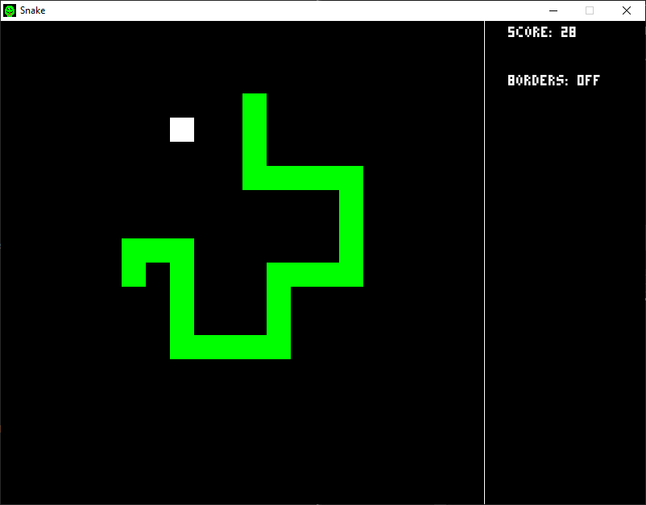
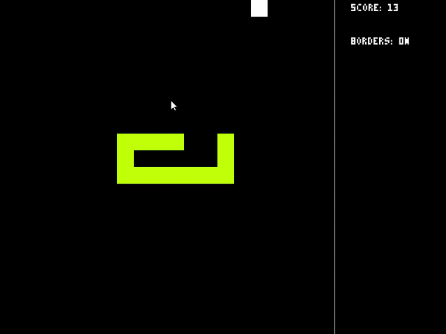

# Snake
A basic snake game using [SFML](https://www.sfml-dev.org/).

* Snake speeds up every 5 points with max speed at 60 points
* Toggleable borders and rainbow mode
* Pausable game

# Controls
```
Movement: WASD or Arrow keys
Rainbow : 1
Borders : 2
Pause   : P
```

# Current Settings
```
Window Size: 800x600
Game Size  : 600x600
Tile Count : 20x20
```

# Gameplay



# Install
1. Download the latest version of [SFML](https://www.sfml-dev.org/download.php). Make sure to download the right SFML version for your system.
2. Clone this repo
```
$ git clone https://github.com/ChrisRzech/Snake.git
```
3. Edit the `SFML_DIR` variable in the `makefile` to the location where SFML is on your system.
4. Build
```
$ make build
```
5. Run
```
$ make run
```