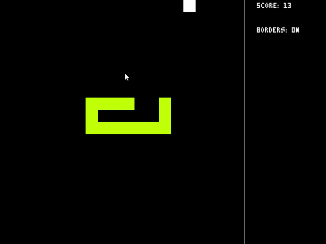

# Snake
A basic snake game that can toggle "Rainbow Mode" and "Wrap Around". This program uses ``SFML 2.4.2``.


# Controls
```
Movement: WASD or Arrow keys
Rainbow : 1
Borders : 2
Pause   : P
Speed+  : Page Up
Speed-  : Page Down
```

# Debugging Controls
```
Tile drawing : F1
Tile position: F2
```

