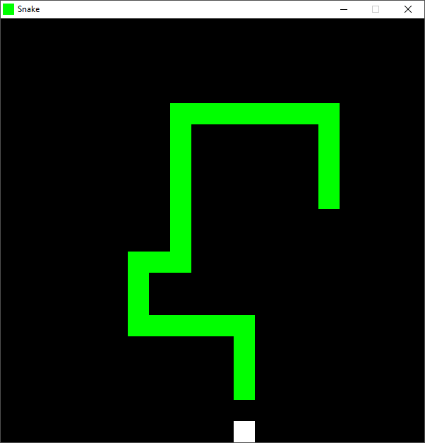

# Snake
A basic snake game that can toggle "Rainbow Mode" and "Wrap Around". This program uses ``SFML 2.4.2``.



# Controls
```
WASD: Movement
Num1: Toggle rainbow colors
Num2: Toggle wrap-around
P   : Pause
```

# Debugging Controls
```
F1: Toggle tile drawing
F2: Toggle tile position using left click
```
